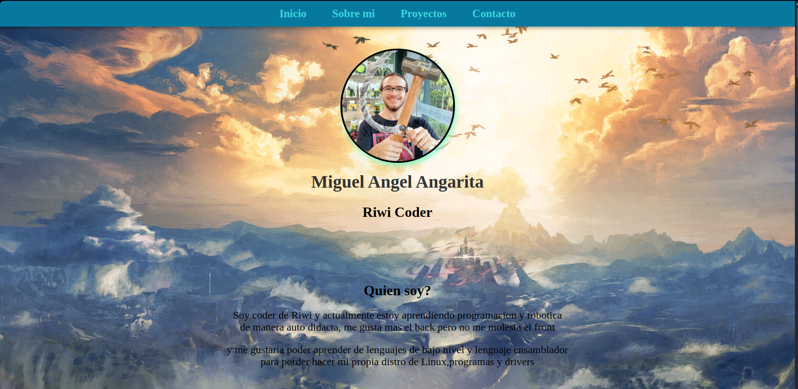
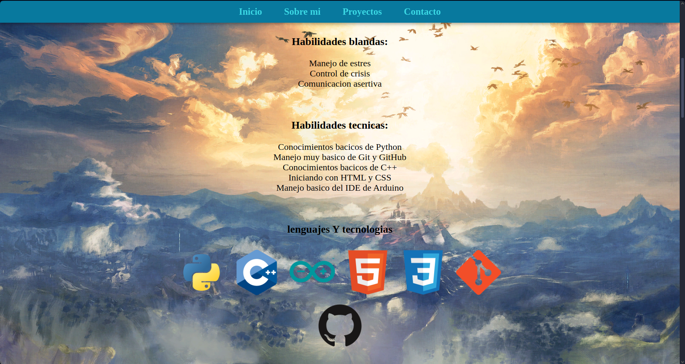
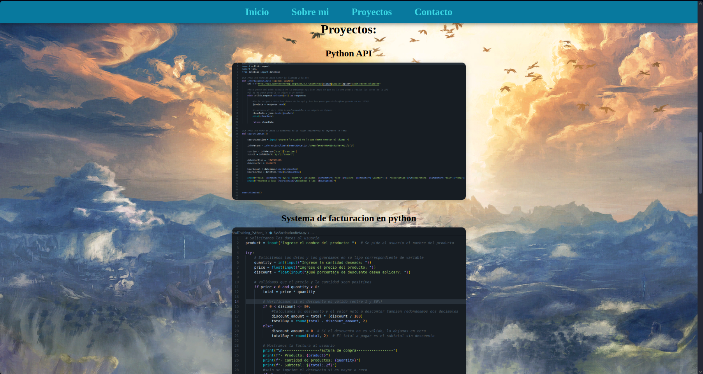

# Documentacion reto M2S2
Este proyecto consta de dos partes principales: un archivo HTML que estructura el contenido y un archivo CSS que da estilo y formato a la página, ademas de los assets.

## HTML
El documento comienza con la estructura basica para un archivo HTML, definiendo el tipo de archivo, con un `<head>` simple pero con meta data y por ultimo el `<body>` haciendo uso de las etiquetas semanticas correctas creo yo.

En la sección `<head>` se incluyen etiquetas esenciales como:

`<meta charset="utf-8" />` para definir la codificación de caracteres.

`<meta name="viewport" content="width=device-width, initial-scale=1.0">` para hacer la página responsiva en dispositivos móviles.

En el `<body>` se estructura el contenido visible:

Un `<header>` que tiene la barra de navegacion, la foto y el nombre.

Un `<main>` con:

La sección “Acerca de mí” con una breve descripción y listas de habilidades blandas y técnicas, acompañadas de imágenes de las tecnologias correspondientes.

La sección “Proyectos” que muestra diferentes proyectos con imágenes ilustrativas del código y menús.

Un `<footer>` con la sección de contacto, incluyendo información, enlaces y un formulario para enviar mensajes.

## CSS
Se establece un fondo con imagen fija y se eliminan márgenes y paddings por defecto en body.

La barra de navegación (.nav-bar) es fija (sticky) en la parte superior, con colores y efectos hover(no termino de entender esto pero es lo que encotre para que se vea lindo) para los enlaces.

La foto y nombre del perfil (.picture-name) se estilizan para centrar y redondear la imagen con sombras y borde.

La sección #about-me y las listas dentro de .skills tienen estilos para centrar texto, eliminar los puntos de las listas y dar espacio entre elementos.

Las imágenes de habilidades son responsivas, mostrando en línea en pantallas grandes y bloque centrado en móviles(esta parte la copie de un ejemplo y funciona pero no termino de entenderla).

La sección de proyectos (#proyects) se centra y estiliza el texto y las imágenes, con efecto de aumento y sombra al pasar el cursor.

El footer (#contact-me) tiene fondo negro con texto blanco, con animación en la imagen del guardian.

La información de contacto usa tablas.

El formulario de contacto esta centrado y no se ve mal.

### Vistazo a la pagina:

